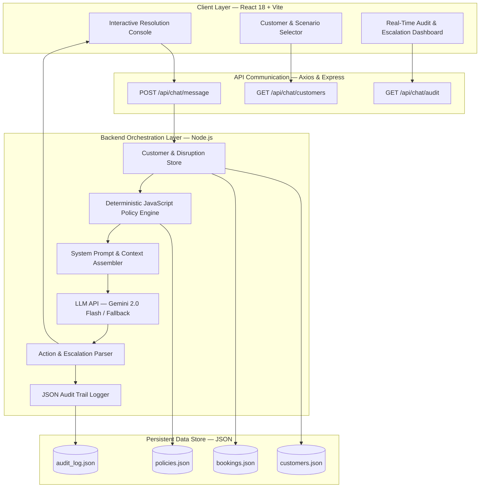

# SkyAssist — Architecture & System Design Document
**Assignment 3: Customer-Facing Resolution Agent (Airline Disruption)**
**Cohort / Target:** AIONOS II Batch 2027

---

## 1. Executive Summary
SkyAssist is an autonomous, policy-bounded resolution agent designed to handle airline disruption journeys (cancellations and delays) under strict operational constraints. By separating deterministic policy guardrails from natural language generation, the system ensures zero hallucination of unauthorized compensation while delivering empathetic, de-escalating customer communication.

---

## 2. High-Level Architecture Diagram

---

## 3. Component Breakdown

### 3.1 Frontend (React + Vite)
- **Framework:** React 18 with Vite for sub-second hot reload and production builds.
- **Styling:** Custom CSS design system with dark mode glassmorphism, responsive panels, and loyalty tier themes (Gold, Silver, Platinum).
- **Key Modules:**
  - `Customer Selector`: Switch between Priya Nair, Arvind Kulkarni, and Meher Kaur with 1-click test scenario presets.
  - `Chat Console`: Real-time streaming conversation bubbles with auto-scroll and quick action triggers.
  - `Policy Inspector`: Side panel exposing real-time deterministic entitlements and hard boundaries.
  - `Audit & Escalation Inspector`: Immediate visual warnings for supervisor/legal escalation handoffs.

### 3.2 Backend (Node.js + Express)
- **REST Endpoints:**
  - `POST /api/chat/message`: Main conversational loop.
  - `GET /api/chat/customers`: Retrieves customer profiles and booking statuses.
  - `GET /api/chat/audit`: Returns persistent JSON compliance logs.
  - `POST /api/chat/reset`: Clears active session state.

### 3.3 Deterministic Policy Engine (`services/policyEngine.js`)
Rather than relying purely on LLM memory to enforce policies, the Policy Engine applies deterministic JavaScript rules directly to booking data:
- **Delay Duration Thresholds:**
  - $< 3\text{h}$: ₹500 meal voucher only.
  - $3\text{h} - 5\text{h}$: Meal voucher + lounge access.
  - $> 5\text{h}$: Meal voucher + lounge access + hotel accommodation for delayed hours only.
- **Cancellation Rule:** Free rebooking within 24h OR full refund to original payment within 7 business days.
- **Fare Difference Rule:** Max allowable waiver is ₹1,500. Anything higher strictly requires supervisor escalation.
- **Loyalty Benefits:** Gold/Platinum customers get priority seat rebooking, but no unauthorized cash or upgrade concessions.

### 3.4 LLM Orchestration & Prompt Engineering (`services/llmService.js`)
- Model: Google Gemini 2.0 Flash (`gemini-2.0-flash`).
- Injects customer profile, disruption status, and deterministic entitlement boundaries directly into the system prompt.
- Enforces empathetic de-escalation tone: always acknowledges frustration first, addresses customer by first name, and clearly states what can and cannot be done.
- Built-in resilient simulator fallback: if the reviewer tests locally without setting `GEMINI_API_KEY`, the agent automatically runs the deterministic policy simulator without crashing.

### 3.5 Action & Escalation Parser (`services/auditService.js`)
- Detects operations: `meal_voucher_issued`, `lounge_access_granted`, `hotel_accommodation_noted`, `refund_initiated`, `supervisor_escalation`.
- Formats tamper-evident JSON records stored in `data/audit/audit_log.json` containing timestamps, session IDs, messages, and escalation reasons.

---

## 4. Scenario Decision Matrix

| Scenario | Customer & Tier | Disruption | Customer Demand | Policy Engine Action | LLM Output & Escalation |
|---|---|---|---|---|---|
| **Scenario 1** | Priya Nair (Gold) | Flight SK-224 Cancelled (Operational) | Full refund + Free Business Class upgrade on return | Entitled to free rebooking OR full refund to original payment | Grants refund/rebook option; denies Business Class upgrade per policy |
| **Scenario 2** | Arvind Kulkarni (Silver) | Flight SK-118 Delayed 4h | Demands hotel accommodation for missed meeting | Entitled to Meal Voucher + Lounge Access only (Delay $\le 5\text{h}$) | Denies hotel politely (requires $>5\text{h}$ delay); confirms meal + lounge active |
| **Scenario 3** | Meher Kaur (Platinum) | Flight SK-305 Delayed 6h | Demands full night hotel + flight change (₹2,000 fare diff) | Delay $>5\text{h}$ covers day-room for delayed hours only; ₹2,000 $> ₹1,500$ waiver limit | Offers delayed-hours hotel; triggers `[ESCALATE]` to supervisor for fare waiver |

---

## 5. Security, Grounding & Safety Guardrails
1. **Zero Hallucination Guarantee:** The LLM's system prompt explicitly binds the agent to the provided data pack and prohibits inventing new airline rules.
2. **Deterministic Ceiling Enforcement:** The UI and backend validate authorized actions before recording them to the audit trail.
3. **Escalation Protocol:** Any mention of formal complaints or legal proceedings triggers immediate handoff to the specialized executive support team.
